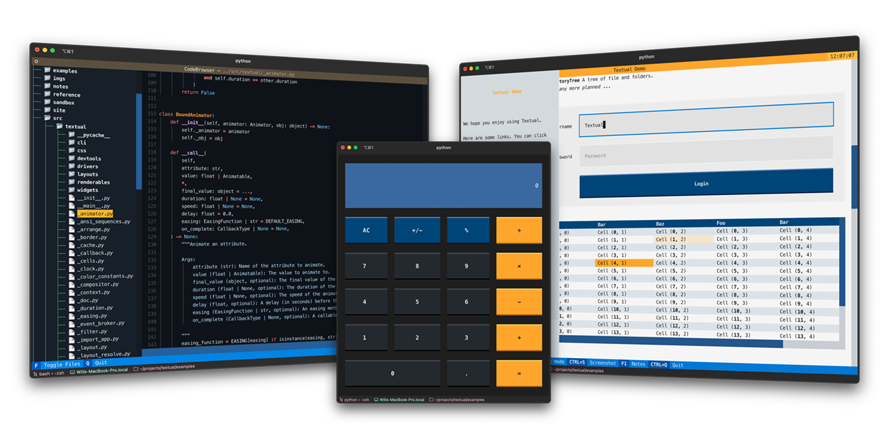

[](https://pypi.org/project/textual/) [](https://badge.fury.io/py/textual)

# Textual



Textual is a Python framework for creating applications within your terminal.

<details>
  <summary> 🎬 Code browser </summary>
  <hr>

  This is the [code_browser.py](./examples/code_browser.py) example which clocks in at 61 lines (*including* docstrings and blank lines).

  https://user-images.githubusercontent.com/554369/189394703-364b5caa-97e0-45db-907d-7b1620d6411f.mov
  
 </details>


## About

Textual adds interactivity to [Rich](https://github.com/Textualize/rich) with a Python API inspired by modern development development.

On modern terminal software (installed by default on most system) Textual apps can use **16.7 million** colors with mouse support and smooth flicker-free animation. A powerful layout engine and re-usable components makes it possible to build apps that rival the desktop and web experience. 

## Compatibility

Textual runs on Linux, MacOS, and Windows. Rich requires Python 3.7 or above.

## Installing

Install Textual via pip:

```
pip install textual[dev]
```

The addition of `[dev]` installs Textual development tools.


## Reference commands

The `textual` command has a few sub-commands to preview Textual styles.

<details>  
  <summary> 🎬 Easing reference </summary>
  <hr>
  
This is the *easing* reference which demonstrates the easing parameter on animation, with both movement and opacity. You can run it with the following command:
  
```bash
textual easing
```

https://user-images.githubusercontent.com/554369/189485538-31e794ff-61d7-4faf-902a-6e90a9d76e5b.mov

 </details>

<details>  
  <summary> 🎬 Borders reference </summary>
  <hr>
  
This is the borders reference which demonstrates some of the borders styles in Textual. You can run it with the following command:
  
```bash
textual borders
```
  

https://user-images.githubusercontent.com/554369/189485735-cb2b4135-caee-46d7-a118-66cd7ed9eef5.mov


  
</details>

## Examples

The Textual repository comes with a number of examples you can experiment with or use as a template for your own projects.

<details>  
  <summary> 📷 Calculator </summary>
  <hr>
  
This is [calculator.py](./examples/calculator.py) which demonstrates Textual grid layouts.
  

</details>

<details>
  <summary> 📷 Code browser </summary>
  <hr>

  This is [code_browser.py](./examples/code_browser.py) which demonstrates the directory tree widget.
  

  
</details>


<details>
  <summary> 📷 Stopwatch </summary>
  <hr>

  This is the Stopwatch example from the tutorial.
  
### Light theme 
  


### Dark theme
  


</details>
