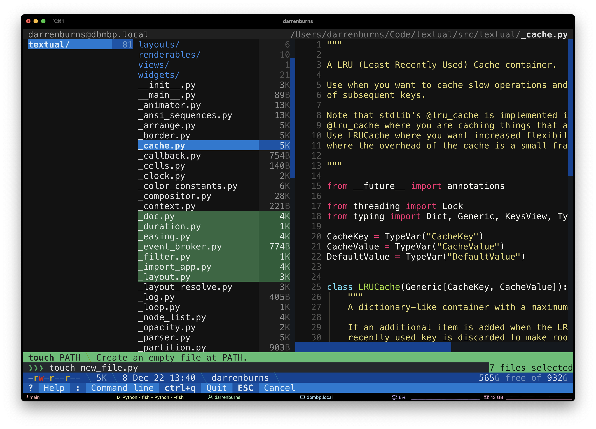
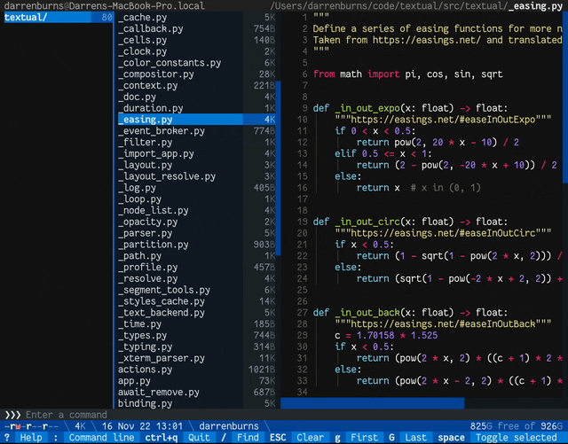
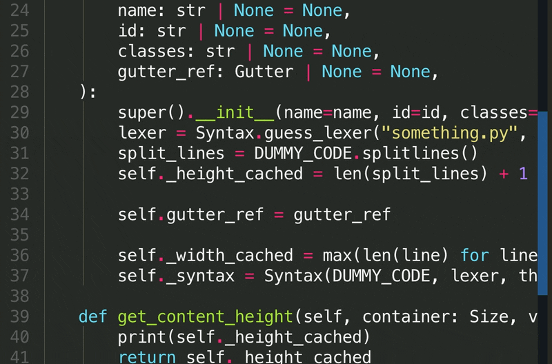
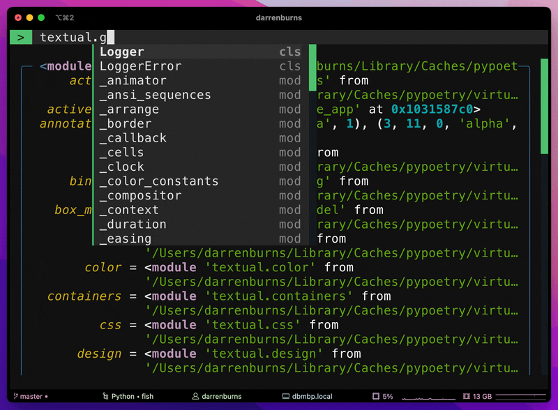

# A year of building for the terminal

I joined Textualize back in January 2022, and since then have been hard at work with the team on both [Rich](https://github.com/Textualize/rich) and [Textual](https://github.com/Textualize/textual).
Over the course of the year, I’ve been able to work on a lot of really cool things.
In this post, I’ll review a subset of the more interesting and visual stuff I’ve built. If you’re into terminals and command line tooling, you’ll hopefully see at least one thing of interest!

<!-- more -->

## A file manager powered by Textual

I’ve been slowly developing a file manager as a “dogfooding” project for Textual. It takes inspiration from tools such as Ranger and Midnight Commander.

As of December 2022, it lets you browse your file system, filtering, multi-selection, creating and deleting files/directories, opening files in your `$EDITOR` and more.

I’m happy with how far this project has come — I think it’s a good example of the type of powerful application that can be built with Textual with relatively little code. I’ve been able to focus on *features*, instead of worrying about terminal emulator implementation details.

The project is available [on GitHub](https://github.com/darrenburns/kupo).

## Better diffs in the terminal

Diffs in the terminal are often difficult to read at a glance. I wanted to see how close I could get to achieving a diff display of a quality similar to that found in the GitHub UI.

To attempt this, I built a tool called [Dunk](https://github.com/darrenburns/dunk). It’s a command line program which you can pipe your `git diff` output into, and it’ll convert it into something which I find much more readable.

Although I’m not particularly proud of the code - there are a lot of “hacks” going on, but I’m proud of the result. If anything, it shows what can be achieved for tools like this.

For many diffs, the difference between running `git diff` and `git diff | dunk | less -R` is night and day.

It’d be interesting to revisit this at some point.
It has its issues, but I’d love to see how it can be used alongside Textual to build a terminal-based diff/merge tool. Perhaps it could be combined with…

## Code editor floating gutter

This is a common feature in text editors and IDEs: when you scroll to the right, you should still be able to see what line you’re on. Out of interest, I tried to recreate the effect in the terminal using Textual.

Textual CSS offers a `dock` property which allows you to attach a widget to an edge of its parent.
By creating a widget that contains a vertical list of numbers and setting the `dock` property to `left`, we can create a floating gutter effect.
Then, we just need to keep the `scroll_y` in sync between the gutter and the content to ensure the line numbers stay aligned.

## Dropdown autocompletion menu

While working on [Shira](https://github.com/darrenburns/shira) (a proof-of-concept, terminal-based Python object explorer), I wrote some autocompleting dropdown functionality.

Textual forgoes the z-index concept from browser CSS and instead uses a “named layer” system. Using the `layers` property you can defined an ordered list of named layers, and using the `layer` property, you can assign a descendant widget to one of those layers.

By creating a new layer above all others and assigning a widget to that layer, we can ensure that widget is painted above everything else.

In order to determine where to place the dropdown, we can track the current value in the dropdown by `watch`ing the reactive input “value” inside the Input widget. This method will be called every time the `value` of the Input changes, and we can use this hook to amend the position of our dropdown position to accommodate for the length of the input value.

I’ve now extracted this into a separate library called [textual-autocomplete](https://github.com/darrenburns/textual-autocomplete).

## Tabs with animated underline

The aim here was to create a tab widget with underlines that animates smoothly as another tab is selected.

<video style="position: relative; width: 100%;" controls autoplay loop><source src="../../../../images/darren-year-in-review/tabs-textual-video-demo.mp4" type="video/mp4"></video>

The difficulty with implementing something like this is that we don’t have pixel-perfect resolution when animating - a terminal window is just a big grid of fixed-width character cells.

{ align=right width=250 }
However, when animating things in a terminal, we can often achieve better granularity using Unicode related tricks. In this case, instead of shifting the bar along one whole cell, we adjust the endings of the bar to be a character which takes up half of a cell.

The exact characters that form the bar are "╺", "━" and "╸". When the bar sits perfectly within cell boundaries, every character is “━”. As it travels over a cell boundary, the left and right ends of the bar are updated to "╺" and "╸" respectively.

## Snapshot testing for terminal apps

One of the great features we added to Rich this year was the ability to export console contents to an SVG. This feature was later exposed to Textual, allowing users to capture screenshots of their running Textual apps.
Ultimately, I ended up creating a tool for snapshot testing in the Textual codebase.

Snapshot testing is used to ensure that Textual output doesn’t unexpectedly change. On disk, we store what we expect the output to look like. Then, when we run our unit tests, we get immediately alerted if the output has changed.

This essentially automates the process of manually spinning up several apps and inspecting them for unexpected visual changes. It’s great for catching subtle regressions!

In Textual, each CSS property has its own canonical example and an associated snapshot test.
If we accidentally break a property in a way that affects the visual output, the chances of it sneaking into a release are greatly reduced, because the corresponding snapshot test will fail.

As part of this work, I built a web interface for comparing snapshots with test output.
There’s even a little toggle which highlights the differences, since they’re sometimes rather subtle.

<video style="position: relative; width: 100%;" controls autoplay loop><source src="../../../../images/darren-year-in-review/Screen_Recording_2022-12-14_at_14.08.15.mov" type="video/mp4"></video>

Since the terminal output shown in the video above is just an SVG image, I was able to add the "Show difference" functionality
by overlaying the two images and applying a single CSS property: `mix-blend-mode: difference;`.

The snapshot testing functionality itself is implemented as a pytest plugin, and it builds on top of a snapshot testing framework called [syrupy](https://github.com/tophat/syrupy).

It's quite likely that this will eventually be exposed to end-users of Textual.

## Demonstrating animation

I built an example app to demonstrate how to animate in Textual and the available easing functions.

<video style="position: relative; width: 100%;" controls loop><source src="../../../../images/darren-year-in-review/animation-easing-example.mov" type="video/mp4"></video>

The smoothness here is achieved using tricks similar to those used in the tabs I discussed earlier.
In fact, the bar that animates in the video above is the same Rich renderable that is used by Textual's scrollbars.

You can play with this app by running `textual easing`. Please use animation sparingly 😉.

## Developer console

When developing terminal based applications, performing simple debugging using `print` can be difficult, since the terminal is in application mode.

A project I worked on earlier in the year to improve the situation was the Textual developer console, which you can launch with `textual console`.

<figure markdown>
    
    <figcaption>On the right, <a href="https://twitter.com/davepdotorg">Dave's</a> 5x5 Textual app. On the left, the Textual console.</figcaption>
</figure>

Then, by running a Textual application with the `--dev` flag, all standard output will be redirected to it.
This means you can use the builtin `print` function and still immediately see the output.
Textual itself also writes information to this console, giving insight into the messages that are flowing through an application.

## Pixel art

Cells in the terminal are roughly two times taller than they are wide. This means, that two horizontally adjacent cells form an approximate square.

Using this fact, I wrote a simple library based on Rich and PIL which can convert an image file into terminal output.
You can find the library, `rich-pixels`, [on GitHub](https://github.com/darrenburns/rich-pixels).

It’s particularly good for displaying simple pixel art images. The SVG image below is also a good example of the SVG export functionality I touched on earlier.

--8<-- "docs/blog/images/darren-year-in-review/bulbasaur.svg"

Since the library generates an object which is renderable using Rich, these can easily be embedded inside Textual applications.

Here's an example of that in a scrapped "Pokédex" app I threw together:

<video style="position: relative; width: 100%;" controls autoplay loop><source src="../../../../images/darren-year-in-review/pokedex-terminal.mov" type="video/mp4"></video>

This is a rather naive approach to the problem... but I did it for fun!

Other methods for displaying images in the terminal include:

- A more advanced library like [chafa](https://github.com/hpjansson/chafa), which uses a range of Unicode characters to achieve a more accurate representation of the image.
- One of the available terminal image protocols, such as Sixel, Kitty’s Terminal Graphics Protocol, and iTerm Inline Images Protocol.

That was a whirlwind tour of just some of the projects I tackled in 2022.
If you found it interesting, be sure to [follow me on Twitter](https://twitter.com/_darrenburns).
I don't post often, but when I do, it's usually about things similar to those I've discussed here.
